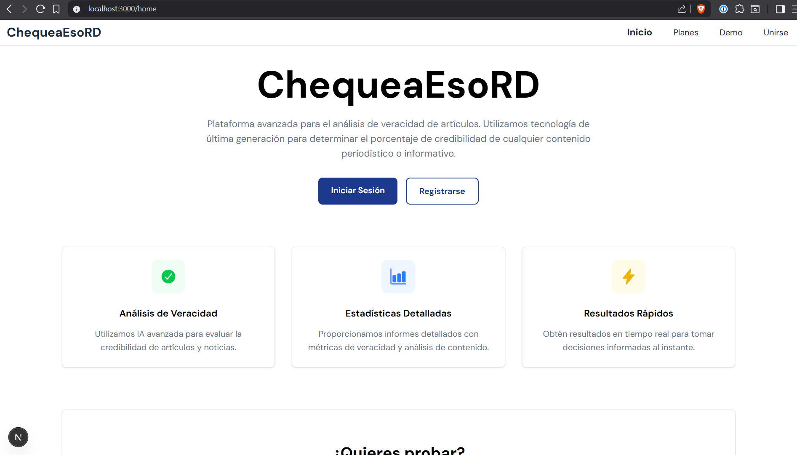
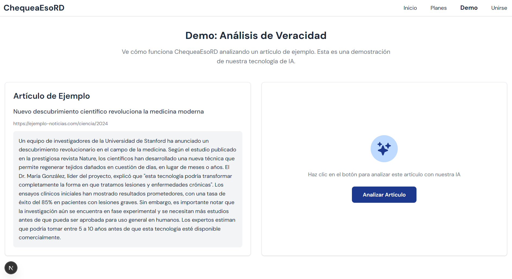
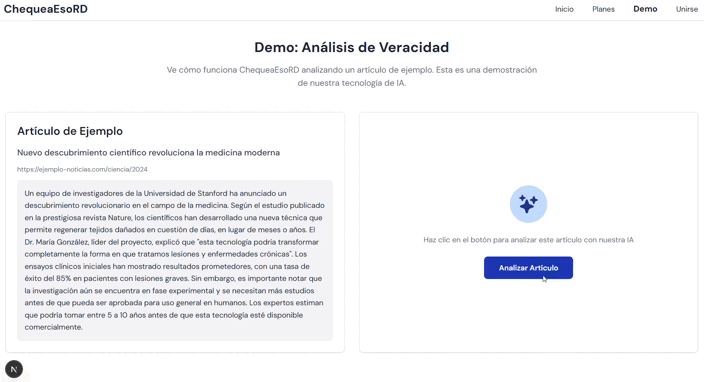
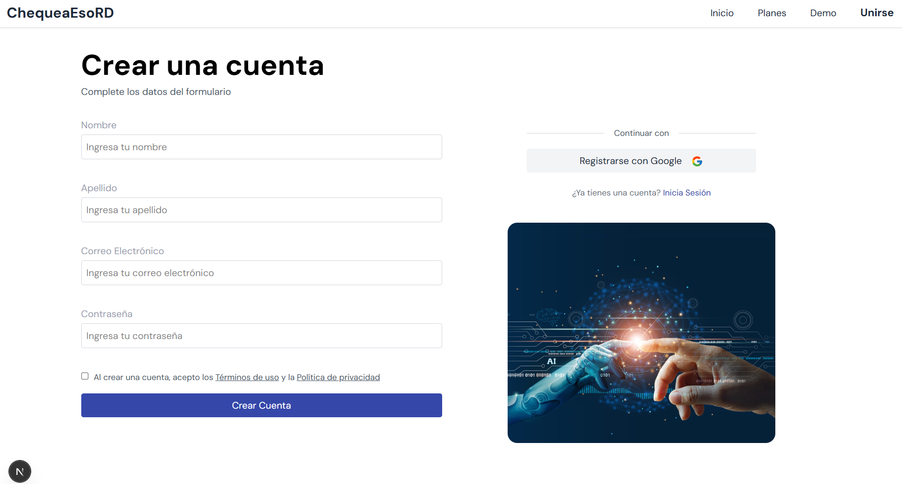

# 🤖 facts-check-platform

ChequeaEsoRD is a fact-checking platform to analyze and verify the authenticity of news articles. Using AI models, it evaluates the credibility of information and provides a score (0 to 100 %) to classify news as "fake" or "real".

## Screenshots / Demo

### Home



### Article Analysis




### Sign Up



## Architecture & Tech Stack

- **Frontend**: React & Next.JS with TypeScript
- **Main Backend**: .NET 8 (C#) CQRS Layer Architecture
- **AI Service**: Python with FastAPI Using OpenAI Services
- **Base de Datos**: PostgreSQL (Deploy on Supabase)

```py
/src/
├── frontend/           # Frontend
| |-- factchecker-front

├── services/           # Backend Services
│ ├── FactCheckBack/    # Main Backend (auth, business logic,data access, etc.)
│ ├── IAModel/          # AI Model Service (Python + FastAPI + OpenAI)
```

### 💻 `frontend/`

Client application developed with React & Next.JS.

- `public/`: Public static files.
- `src/features/`: Functional modules of the app (e.g., authentication, profile, publications).
- `src/components/`: Reusable components between modules.
- `src/pages/`: Views connected to main routes.
- `src/services/`: HTTP clients (fetch or axios) that communicate with the microservices.
- `src/app/`: Global application configuration (routes, context, global state).

The decision to use Next.JS allows for server-side rendering and improved performance, while TypeScript ensures type safety across the codebase.

### ⚙️ `services/`

#### 🔍 `FactCheckBack/`

Main backend developed with .NET 8, structured with a CQRS pattern.

- `FactCheckBack.API/`: Entry point of the application (controllers, API configuration).
- `FactCheckBack.Data/`: Data access layer (repositories, database context).
- `FactCheckBack.Business/`: Business logic and CQRS handlers, services, etc.
- `FactCheckBack.Models/`: Internal models (DTOs, Requests, Responses).

The decision to use the CQRS pattern allows for better scalability and separation of read and write operations, improving performance and maintainability as the application grows.

#### 🤖 `IAModel/`

AI model service developed with Python and FastAPI, utilizing OpenAI services.

- `IAModel/app.py`: Main application file with FastAPI configuration and route definitions.
- `IAModel/services/`: Services that interact with OpenAI APIs and handle AI logic.

This service is responsible for processing news articles, analyzing their content, and returning a credibility score based on the AI model's evaluation.

## Setup & Installation

1. **Clone the repository**:
    ```bash
    git clone
    ```
2. **Navigate to the project directory**:
    ```bash
    cd facts-check-platform
    ```
3. **Setup the backend**:
    ```bash
    cd services/FactCheckBack
    dotnet restore
    dotnet run
    ```
4. **Setup the AI service**:
    ```bash
    cd services/IAModel
    pip install -r requirements.txt
    uvicorn app:app --reload
    ```
5. **Setup the frontend**:
    ```bash
    cd src/frontend
    npm install
    npm run dev
    ```
6. **Access the application**:
   Open your browser and navigate to `http://localhost:3000` to access the platform.
